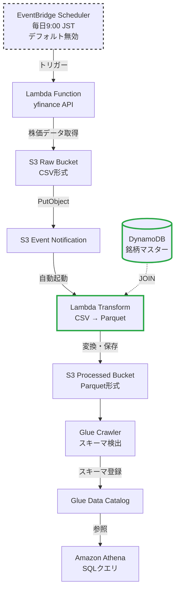
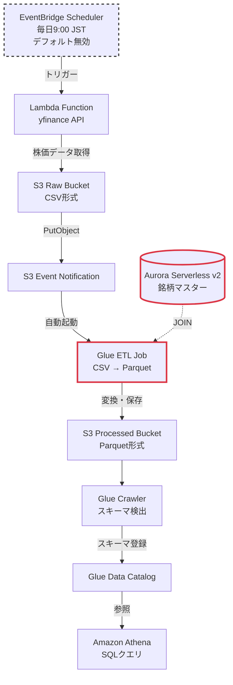

# yfinance AWS Data Pipeline Project

AWS CDK (TypeScript) を使用して構築する株価データパイプライン学習用のプロジェクトです。
・無課金で学習可能な「DynamoDB + Lambda」構成
・実務を想定した「Aurora + Glue ETL」構成
以上の2パターンを用意。

[](https://github.com/aws/aws-cdk)
[](https://www.typescriptlang.org/)
[](https://www.python.org/)
[](https://pypi.org/project/yfinance/)
[](https://pandas.pydata.org/)
[](./LICENSE)
[](https://github.com)

## アーキテクチャの選択

本プロジェクトは**2つのアーキテクチャ**を提供しています：

| 構成要素 | 無課金構成（推奨） | 有料構成（本番想定） |
|:--------|:-----------------|:-------------------|
| **マスターDB** | DynamoDB (無料) | Aurora Serverless v2 (~$100/月) |
| **変換処理** | Lambda Transform (無料) | Glue ETL Job (~$10/実行) |
| **その他** | S3 + Lambda + Glue Crawler | S3 + Lambda + Glue Crawler |
| **月額概算** | ほぼ$0（無料枠内） | ~$100 + 実行コスト |
| **用途** | 学習・検証 | 本番運用 |

**共通スタック:**
- S3Stack (Raw/Processed/Athena結果)
- IAM Role
- Lambda (yfinance データ取得)
- EventBridge Scheduler (オプション)
- Glue Crawler (スキーマ検出)
- Athena (SQL分析)

**切り替え方法**: `bin/stock-etl.ts` の `useFreeTier` フラグで選択
```typescript
const useFreeTier = true;  // true: 無課金構成, false: 有料構成
```

## プロジェクト概要

- yfinance で株価取得
- S3 raw に保存
- Glue ETL Job で Parquet へ変換
- Aurora の銘柄マスターと JOIN 可能な形式に加工
- **セクター階層パーティション**で S3 processed に保存
- Glue Crawler → Athena で分析可能

**学習ポイント:**
- IoT実装で使われる `region/device/timestamp` と同じ階層パーティション設計
- 実務的なパーティションプルーニングによるコスト最適化
- 本プロジェクトを通じてマルチテナントSaaS、ログ分析で頻出する設計パターンが学習できる

## アーキテクチャ

### A.無課金構成（デフォルト）



### B.有料構成（useFreeTier=false）



**データフロー:**

| ステップ | 無課金構成 | 有料構成 |
|:--------:|:----------:|:--------:|
| 1. データ取得 | Lambda (yfinance) から株価データを取得 || 
| 2. Raw保存 | S3 Raw に CSV 形式で保存 ||
| 3. 変換処理起動 | **Lambda Transform** が自動起動 | **Glue ETL Job** が自動起動 |
| 4. マスター JOIN | **DynamoDB マスター**と JOIN | **Aurora マスター**と JOIN |
| 5. 変換・保存 | セクター階層パーティションで Parquet 形式に変換 → S3 Processed ||
| 6. カタログ化 | Glue Crawler がスキーマを検出 ||
| 7. 分析 | Athena でセクター別 SQL 分析 ||

> **注:** S3イベント通知による自動起動は実装済みですが、デフォルトでは無効（コスト削減のため）

**注意**: 
- EventBridge Scheduler: デフォルトは無効（コスト削減のため）
- S3イベント通知: 実装済みだがデフォルトは無効（コスト削減のため）
- 有効化する場合: `bin/stock-etl.ts` で `s3EventNotificationEnabled: true` に変更 (高額課金となるため要注意)

**パーティション構造（IoTパターン）:**
```
processed/
  sector=Technology/
    ticker=AAPL/
      year=2024/month=11/day=24/xxx.parquet
    ticker=MSFT/
      year=2024/month=11/day=24/xxx.parquet
  sector=Consumer_Cyclical/
    ticker=AMZN/
      year=2024/month=11/day=24/xxx.parquet
```

メリット:
- WHERE句利用時(`WHERE sector='Technology'`) に他セクターはスキャンされない（コスト削減）
- セクター別ビューで業界分析が容易

## プロジェクト構造

```
yfinance_aws_project/
  bin/          # CDKエントリポイント
  lib/          # 各スタック定義
  lambda/       # Lambda関数コード
  glue/         # Glue ETLスクリプト
  sql/          # Aurora DDL
```

## データ構造

**Raw データ (CSV):**
```
s3://raw/{ticker}/{yyyy}/{MM}/{dd}/{ticker}_{yyyy-MM-dd}.csv
```

**Processed データ (Parquet):**
```
s3://processed/ticker={ticker}/year={year}/month={month}/day={day}/
```

**カラム構成:**
```
ticker, date, year, month, day, open, high, low, close, volume,
sector, exchange, country, ingested_at, source_file
```

## Glue ETL 処理

### 無課金構成（Lambda Transform）

1. S3 Raw CSV 読み込み
2. DynamoDB から銘柄マスターを取得
3. pandas で JOIN 処理
4. セクター階層パーティション作成
5. Parquet に変換・S3 Processed に保存

### 有料構成（Glue ETL Job）

1. S3 Raw CSV 読み込み
2. 日付パーティション抽出
3. Aurora マスター JOIN
4. Parquet に変換・保存

## マスターデータ管理

### DynamoDB（無課金構成）

**テーブル名**: `stock-master`

**スキーマ:**
```json
{
  "ticker": "AAPL",
  "name": "Apple Inc.",
  "sector": "Technology",
  "exchange": "NASDAQ",
  "country": "US",
  "is_active": true
}
```

**シードデータ投入:**
```bash
# 方法1: Node.jsスクリプト（推奨）
node scripts/seed-dynamodb.js

# 方法2: AWS CLI
aws dynamodb put-item --table-name stock-master --item file://dynamodb/seed_data.json
```

詳細: [dynamodb/README.md](./dynamodb/README.md)

### Aurora（有料構成）

**スキーマ:**
```sql
CREATE TABLE stocks (
  ticker VARCHAR(10) PRIMARY KEY,
  name VARCHAR(255),
  sector VARCHAR(100),
  exchange VARCHAR(50),
  country VARCHAR(50),
  is_active BOOLEAN,
  created_at DATETIME,
  updated_at DATETIME
);
```

## Athena 分析

Glue Crawler 実行後、以下が可能:
- セクター別集計
- 月次サマリー
- 銘柄間比較

## セットアップ

### 前提条件
- Node.js 18.x 以上
- AWS CLI 設定済み
- AWS CDK CLI インストール済み

### インストール

```bash
npm install
cdk bootstrap  # 初回のみ
```

### デプロイ

**無課金構成（推奨）:**
```bash
# bin/stock-etl.ts で useFreeTier = true を確認

# 全スタックデプロイ
cdk deploy --all

# シードデータ投入
node scripts/seed-dynamodb.js
```

**有料構成:**
```bash
# bin/stock-etl.ts で useFreeTier = false に変更

# 全スタックデプロイ（高額注意）
cdk deploy --all
```

## 使い方

### 自動実行（本番想定）

1. **Scheduler有効化**: `bin/stock-etl.ts` で `scheduleEnabled: true`
2. **S3イベント有効化**: `bin/stock-etl.ts` で `s3EventNotificationEnabled: true`
3. 再デプロイ: `cdk deploy --all`

→ 毎日自動で Lambda → S3 → Glue ETL → Crawler → Athena のパイプラインが実行されます

### 手動実行（学習・コスト削減）

**無課金構成:**
```bash
# Lambda実行（株価取得）
aws lambda invoke --function-name FetchStockDataFunction response.json

# Lambda Transform実行（Parquet変換）
aws lambda invoke --function-name TransformCSVtoParquetFunction response.json

# Crawler実行
aws glue start-crawler --name stock-data-processed-crawler

# Athena クエリ
# AWS Console または CLI で実行
```

**有料構成:**
```bash
# Lambda実行
aws lambda invoke --function-name FetchStockDataFunction response.json

# Glue Job実行
aws glue start-job-run --job-name stock-data-csv-to-parquet

# Crawler実行
aws glue start-crawler --name stock-data-processed-crawler

# Athena クエリ
# AWS Console または CLI で実行
```

## 詳細ドキュメント

- [ARCHITECTURE.md](./ARCHITECTURE.md) - アーキテクチャ詳細
- [DEPLOYMENT.md](./DEPLOYMENT.md) - デプロイ手順
- [USAGE.md](./USAGE.md) - 使用方法
- [PRACTICAL_GUIDE.md](./PRACTICAL_GUIDE.md) - 実務パターン

## ライセンス

MIT License
