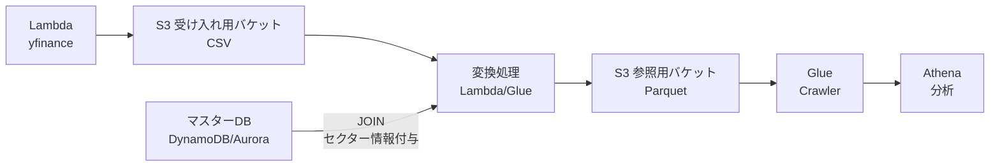

# yfinance AWS Data Pipeline Project

AWS CDK (TypeScript) を使用して構築する株価データパイプライン学習プロジェクト。

- 無課金で学習可能な「DynamoDB + Lambda」構成
- 実務を想定した「Aurora + Glue ETL」

以上の2パターンを用意しています

[](https://github.com/aws/aws-cdk)
[](https://www.typescriptlang.org/)
[](https://www.python.org/)
[](https://pypi.org/project/yfinance/)
[](https://pandas.pydata.org/)
[](./LICENSE)
[](https://github.com)

## アーキテクチャの選択

| 構成要素 | 無課金構成（推奨） | 有料構成（本番想定） |
|:--------|:-----------------|:-------------------|
| **マスターDB** | DynamoDB (無料) | Aurora Serverless v2 (~$100/月) |
| **変換処理** | Lambda Transform (無料) | Glue ETL Job (~$10/実行) |
| **月額概算** | ほぼ$0（無料枠内） | ~$100 + 実行コスト |

**共通**: S3 (受け入れ用バケット/参照用バケット) + Lambda (データ取得) + Glue Crawler + Athena

**切り替え**: `bin/stock-etl.ts` の `useFreeTier` フラグ

## クイックスタート

```bash
# 1. インストール
npm install
cdk bootstrap  # 初回のみ

# 2. デプロイ（無課金構成）
cdk deploy --all

# 3. シードデータ投入
node scripts/seed-dynamodb.js

# 4. 手動実行
aws lambda invoke --function-name FetchStockDataFunction response.json
aws lambda invoke --function-name TransformCSVtoParquetFunction response.json
aws glue start-crawler --name stock-data-processed-crawler
```

## アーキテクチャ図



**無課金**: 変換=Lambda, DB=DynamoDB  
**有料**: 変換=Glue ETL, DB=Aurora

## データフロー

| ステップ | 無課金構成 | 有料構成 |
|:--------|:----------|:---------|
| 1. 取得 | Lambda (yfinance) ||
| 2. Raw保存 | S3 (CSV) ||
| 3. 変換 | **Lambda Transform** | **Glue ETL Job** |
| 4. JOIN | **DynamoDB** | **Aurora** |
| 5. Processed保存 | S3 (Parquet + セクター階層パーティション) ||
| 6. カタログ化 | Glue Crawler ||
| 7. 分析 | Athena (SQL) ||

> EventBridge Scheduler, S3イベント通知はデフォルト無効（コスト削減）

## S3 参照用バケット データ構造

### パーティション階層

| 種別 | 階層1 | 階層2 | 階層3 | 階層4 | 階層5 | 格納先 |
|:-----|:------|:------|:------|:------|:------|:------|
| **マスター** | ticker | - | - | - | - | DynamoDB/Aurora |
| **ログ** | sector | ticker | year | month | day | S3 Parquet |

**例**: `s3://processed/sector=Technology/ticker=AAPL/year=2024/month=11/day=24/data.parquet`

**学習ポイント**: IoT/SaaS で頻出の `region/device/timestamp` 型パーティション設計

### マスタースキーマ

| カラム | DynamoDB | Aurora | 説明 |
|:------|:---------|:-------|:-----|
| ticker | String (PK) | VARCHAR(10) PK | 銘柄コード |
| name | String | VARCHAR(255) | 会社名 |
| sector | String | VARCHAR(100) | セクター |
| exchange | String | VARCHAR(50) | 取引所 |
| country | String | VARCHAR(50) | 国 |
| is_active | Boolean | BOOLEAN | アクティブ |
| created_at | - | DATETIME | 作成日時 |
| updated_at | - | DATETIME | 更新日時 |

## 使い方

### 有料構成に切り替え

```bash
# bin/stock-etl.ts で useFreeTier = false に変更
cdk deploy --all
```

### 自動実行を有効化

```bash
# bin/stock-etl.ts で以下を true に変更
# - scheduleEnabled: true (毎日9:00 JST)
# - s3EventNotificationEnabled: true (S3アップロード時)
cdk deploy --all
```

## プロジェクト構造

```
yfinance_aws_project/
  bin/          # CDKエントリポイント
  lib/          # 各スタック定義
  lambda/       # Lambda関数コード
  glue/         # Glue ETLスクリプト
  dynamodb/     # DynamoDBシードデータ
  scripts/      # ユーティリティスクリプト
```

## 詳細ドキュメント

- [dynamodb/README.md](./dynamodb/README.md) - DynamoDBシードデータ投入
- [ARCHITECTURE.md](./ARCHITECTURE.md) - アーキテクチャ詳細
- [DEPLOYMENT.md](./DEPLOYMENT.md) - デプロイ手順
- [USAGE.md](./USAGE.md) - 使用方法
- [PRACTICAL_GUIDE.md](./PRACTICAL_GUIDE.md) - 実務パターン

## ライセンス

MIT License
