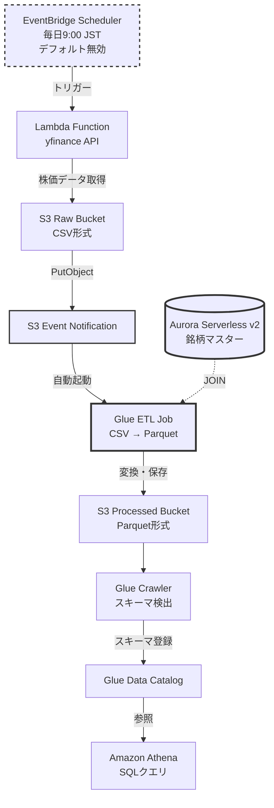

# yfinance AWS Data Pipeline Project

AWS CDK (TypeScript) を使用して構築する株価データパイプライン学習プロジェクト。
実務で扱われる「S3 にログ、Aurora にマスター」構造を安全に再現し、
データレイク & ETL の基礎から応用までを学習できます。

[](https://github.com/aws/aws-cdk)
[](https://www.typescriptlang.org/)
[](./LICENSE)
[](https://github.com)

## コストについて

本プロジェクトに高額サービスが含まれます。
課金回避のため等、Aurora と Glueは、初期はdisabled で設定。

| Stack | 月額概算 | デプロイ可否 |
|-------|-----------|--------------|
| S3Stack | ~$1 | 利用推奨 |
| IamStack | $0 | 利用推奨 |
| LambdaStack | ~$0 | 利用推奨 |
| SchedulerStack | ~$1 | デフォルト無効 |
| AuroraStack | ~$100/月 | 非推奨 |
| GlueStack | ~$10/実行 | 手動実行推奨 |
| AthenaStack | 従量課金 | 必要時 |

## プロジェクト概要

- yfinance で株価取得
- S3 raw に保存
- Glue ETL Job で Parquet へ変換
- Aurora の銘柄マスターと JOIN 可能な形式に加工
- **セクター階層パーティション**で S3 processed に保存
- Glue Crawler → Athena で分析可能

**学習ポイント:**
- IoT実装で使われる `region/device/timestamp` と同じ階層パーティション設計
- 実務的なパーティションプルーニングによるコスト最適化
- 本プロジェクトを通じてマルチテナントSaaS、ログ分析で頻出する設計パターンが学習できる

## アーキテクチャ



**データフロー:**
1. Lambda が yfinance から株価データを取得
2. S3 Raw に CSV 形式で保存
3. **S3イベント通知**で Glue ETL が自動起動（実装済み、デフォルト無効）
4. Glue ETL が CSV を読み込み、Aurora マスターと JOIN
5. **セクター階層パーティション**で Parquet 形式に変換して S3 Processed に保存
6. Glue Crawler がスキーマを検出
7. Athena でセクター別 SQL 分析

**注意**: 
- EventBridge Scheduler: デフォルトは無効（コスト削減のため）
- S3イベント通知: 実装済みだがデフォルトは無効（コスト削減のため）
- 有効化する場合: `bin/stock-etl.ts` で `s3EventNotificationEnabled: true` に変更 (高額課金となるため要注意)

**パーティション構造（IoTパターン）:**
```
processed/
  sector=Technology/
    ticker=AAPL/
      year=2024/month=11/day=24/xxx.parquet
    ticker=MSFT/
      year=2024/month=11/day=24/xxx.parquet
  sector=Consumer_Cyclical/
    ticker=AMZN/
      year=2024/month=11/day=24/xxx.parquet
```

メリット:
- WHERE句利用時(`WHERE sector='Technology'`) に他セクターはスキャンされない（コスト削減）
- セクター別ビューで業界分析が容易

## プロジェクト構造

```
yfinance_aws_project/
  bin/          # CDKエントリポイント
  lib/          # 各スタック定義
  lambda/       # Lambda関数コード
  glue/         # Glue ETLスクリプト
  sql/          # Aurora DDL
```

## データ構造

**Raw データ (CSV):**
```
s3://raw/{ticker}/{yyyy}/{MM}/{dd}/{ticker}_{yyyy-MM-dd}.csv
```

**Processed データ (Parquet):**
```
s3://processed/ticker={ticker}/year={year}/month={month}/day={day}/
```

**カラム構成:**
```
ticker, date, year, month, day, open, high, low, close, volume,
sector, exchange, country, ingested_at, source_file
```

## Aurora スキーマ

```sql
CREATE TABLE stocks (
  ticker VARCHAR(10) PRIMARY KEY,
  name VARCHAR(255),
  sector VARCHAR(100),
  exchange VARCHAR(50),
  country VARCHAR(50),
  is_active BOOLEAN,
  created_at DATETIME,
  updated_at DATETIME
);
```

## Glue ETL 処理

1. Raw CSV 読み込み
2. 日付パーティション抽出
3. Aurora マスター JOIN
4. Parquet に変換・保存

## Athena 分析

Glue Crawler 実行後、以下が可能:
- セクター別集計
- 月次サマリー
- 銘柄間比較

## セットアップ

### 前提条件
- Node.js 18.x 以上
- AWS CLI 設定済み
- AWS CDK CLI インストール済み

### インストール

```bash
npm install
cdk bootstrap  # 初回のみ
```

### デプロイ

```bash
# 推奨: 低コストスタックのみ
cdk deploy S3Stack IamStack LambdaStack

# 全スタックデプロイ (非推奨: 高額)
cdk deploy --all
```

## 使い方

### 自動実行（本番想定）

1. **Scheduler有効化**: `bin/stock-etl.ts` で `scheduleEnabled: true`
2. **S3イベント有効化**: `bin/stock-etl.ts` で `s3EventNotificationEnabled: true`
3. 再デプロイ: `cdk deploy --all`

→ 毎日自動で Lambda → S3 → Glue ETL → Crawler → Athena のパイプラインが実行されます

### 手動実行（学習・コスト削減）

```bash
# Lambda実行
aws lambda invoke --function-name FetchStockDataFunction response.json

# Glue Job実行
aws glue start-job-run --job-name stock-data-csv-to-parquet

# Crawler実行
aws glue start-crawler --name stock-data-processed-crawler

# Athena クエリ
# AWS Console または CLI で実行
```

## 詳細ドキュメント

- [ARCHITECTURE.md](./ARCHITECTURE.md) - アーキテクチャ詳細
- [DEPLOYMENT.md](./DEPLOYMENT.md) - デプロイ手順
- [USAGE.md](./USAGE.md) - 使用方法
- [PRACTICAL_GUIDE.md](./PRACTICAL_GUIDE.md) - 実務パターン

## ライセンス

MIT License
