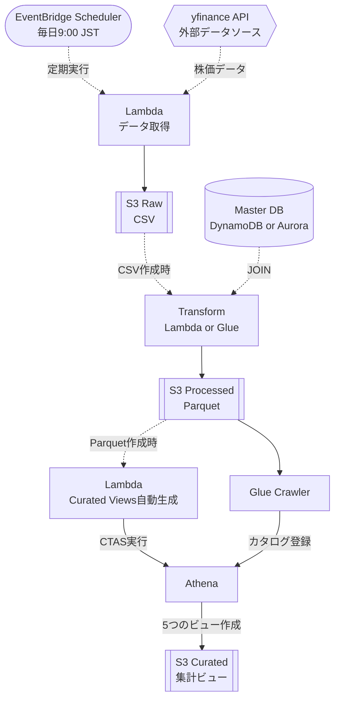

# yfinance AWS Data Pipeline Project

AWS CDK (TypeScript) を使用して構築する **株価データパイプライン学習プロジェクト**。  
実務でよくある「S3 にログ、Aurora にマスター」という構造を、株価データを題材に再現したテンプレートです。

---

## 構成の狙い

本プロジェクトは、学習コストを抑えながら実務構造も理解できるように、

- **低コストで動作する DynamoDB + Lambda 構成**
- **本番運用を想定した Aurora + Glue 構成**

の **2パターン切り替え式** のアーキテクチャにしています。

設定は [`bin/stock-etl.ts` L72](./bin/stock-etl.ts#L72) の `useFreeTier` フラグで切り替えできます。

---

## バッジ

[](https://github.com/aws/aws-cdk)
[](https://www.typescriptlang.org/)
[](https://www.python.org/)
[](https://pypi.org/project/yfinance/)
[](https://pandas.pydata.org/)
[](./LICENSE)

---

## アーキテクチャ概要



---

## アーキテクチャ比較

| 構成 | 低コスト構成（学習向け） | 本番構成（実務想定） |
|------|-----------------------|------------------------|
| マスターDB | **DynamoDB** (無料枠) | **Aurora Serverless v2** (~$100/月) |
| 変換処理 | **Lambda Transform** | **Glue ETL Job** (~$10/実行) |
| スケジューラ | EventBridge（デプロイ時は無効・手動で有効化） | 〃 |
| カタログ | Glue Crawler | 〃 |
| 分析 | Athena | 〃 |
| 月額概算 | **$0** | **$100+** |

---

## データフロー

### 共通パイプライン
1. **データ取得**: Lambda (yfinance) → S3 Raw (CSV)
2. **変換処理**: マスターJOIN → Parquet変換
3. **カタログ化**: Glue Crawler → Athena
4. **集計ビュー**: Lambda → Athena CTAS → S3 Curated

### 構成による違い

| 処理 | 低コスト構成 | 本番構成 |
|------|-------------|----------|
| **マスターDB** | DynamoDB (無料枠) | Aurora Serverless v2 |
| **変換処理** | Lambda Transform | Glue ETL Job |
| **月額コスト** | **$0** | **$100+** |

### Curated ビュー自動生成の仕組み

Processed bucket に Parquet ファイルが作成されると、S3 イベント通知により Lambda が自動起動し、5つの集計ビューを作成します。

**生成されるビュー:**
1. `sector_daily_summary` - セクター別日次サマリー
2. `ticker_monthly_summary` - 銘柄別月次サマリー
3. `sector_performance_ranking` - セクター内パフォーマンスランキング
4. `cross_sector_comparison` - セクター横断比較（セクターローテーション分析）
5. `volatility_analysis` - ボラティリティ分析（リスク指標）

**コスト:** 5銘柄×365日で約100KBのParquet → 5クエリで~500KB = **$0.0025/回**（年間$0.91 ≈ 140円）

---

## データレイク3層構造

| 層 | バケット | 形式 | 説明 |
|----|---------|------|------|
| **Raw** | `stock-data-raw` | CSV | yfinance から取得した生データ |
| **Processed** | `stock-data-processed` | Parquet | マスターJOIN済み、パーティション分割 |
| **Curated** | `stock-data-curated` | Parquet | セクター別集計、月次サマリー等のビジネスビュー |

---

## S3 Processed バケットの構造

IoT でよく使われる  
`device/type/year/month/day` 型の階層を **株価用にアレンジ**しています。

```
s3://参照用バケット/
  sector=Technology/
    ticker=AAPL/
      year=2024/
        month=11/
          day=24/
            data.parquet
```

### Parquet カラム例

| カラム | 説明 |
|--------|------|
| ticker | 銘柄コード |
| date | 日付 |
| year / month / day | パーティションキー |
| open / high / low / close | 株価 |
| volume | 出来高 |
| sector / exchange / country | マスター（DynamoDB/Aurora）JOIN結果 |
| ingested_at | 変換処理の実行時間 |
| source_file | 元 CSV ファイル名 |

---

## マスター（DynamoDB/Aurora）

**DynamoDB（低コスト）**  
or  
**Aurora（本番想定）**

```sql
CREATE TABLE stocks (
  ticker VARCHAR(10) PRIMARY KEY,
  name VARCHAR(255),
  sector VARCHAR(100),
  exchange VARCHAR(50),
  country VARCHAR(50),
  is_active BOOLEAN DEFAULT TRUE,
  created_at DATETIME DEFAULT CURRENT_TIMESTAMP,
  updated_at DATETIME DEFAULT CURRENT_TIMESTAMP ON UPDATE CURRENT_TIMESTAMP
);
```

---

## プロジェクト構造

```
yfinance_aws_project/
  bin/
  lib/
  lambda/
  glue/
  dynamodb/
  scripts/
```

---

## 使い方

### 低コスト構成（DynamoDB + Lambda）

**デフォルト構成 - 推奨**

#### 1. デプロイ

```bash
npm install
cdk bootstrap
cdk deploy --all
```

**理由:** シードデータは CDK で自動投入されるため、デプロイ後すぐに利用可能

#### 2. データパイプライン実行

```bash
# 株価データ取得
aws lambda invoke --function-name FetchStockDataFunction response.json

# CSV→Parquet 変換
aws lambda invoke --function-name TransformCSVtoParquetFunction response.json

# カタログ化
aws glue start-crawler --name stock-data-processed-crawler

# Curated ビューは自動生成されます（Processed bucket へのファイル作成時）
# Lambda CreateCuratedViewsFunction が S3 イベント通知で自動起動
```

**確認方法:**
```bash
# Lambda 実行ログ確認
aws logs tail /aws/lambda/CreateCuratedViewsFunction --follow

# Athena でビュー確認
aws athena start-query-execution \
  --query-string "SELECT * FROM curated_db.sector_daily_summary LIMIT 10" \
  --result-configuration "OutputLocation=s3://your-curated-bucket/athena-results/"
```

#### 3. 手動でビュー再作成（オプション）

```bash
# Lambda を手動起動
aws lambda invoke --function-name CreateCuratedViewsFunction response.json

# または Node.js スクリプトで実行
node scripts/create-curated-views.js
```

---

### 本番構成（Aurora + Glue）

**コスト: ~$100/月 + 実行コスト**

#### 1. 構成切り替え

[`bin/stock-etl.ts` L72](./bin/stock-etl.ts#L72) を編集：

```ts
const useFreeTier = false;  // true → false に変更
```

#### 2. デプロイ

```bash
cdk deploy --all
```

#### 3. Aurora マスターデータ初期化

**理由:** Aurora は SQL 実行が必要なため手動セットアップ

```bash
# VPC 内から実行、または Bastion 経由
mysql -h <aurora-endpoint> -u admin -p stock_data_db < sql/aurora_setup.sql
```

または AWS Console → RDS → Query Editor で [`sql/aurora_setup.sql`](./sql/aurora_setup.sql) を実行

#### 4. データパイプライン実行

```bash
# 株価データ取得
aws lambda invoke --function-name FetchStockDataFunction response.json

# Glue ETL Job 実行
aws glue start-job-run --job-name stock-etl-job

# カタログ化
aws glue start-crawler --name stock-data-processed-crawler
```

#### 5. Curated ビュー作成（オプション）

```bash
node scripts/create-curated-views.js
```

---

## 自動化を有効化する

※ デフォルトは **コスト削減のため無効**

```ts
// bin/stock-etl.ts
scheduleEnabled = true
s3EventNotificationEnabled = true
```

---

## 応用例

yfinance はサンプルデータソースです。Lambda 関数を差し替えることで、様々な時系列データに対応可能：

- **IoT センサーデータ**: 温度、湿度、振動などのデバイスログ
- **アプリケーションログ**: API アクセスログ、エラーログ
- **気象データ**: 気温、降水量、風速などの観測データ
- **ソーシャルメディア**: ツイート数、エンゲージメント推移
- **Web アナリティクス**: PV、UU、滞在時間などのアクセス解析

パーティション構造（`sector/ticker/year/month/day`）は、  
`region/device/year/month/day` や `service/endpoint/year/month/day` 等に置き換え可能です。

---

## ライセンス

MIT License

---
